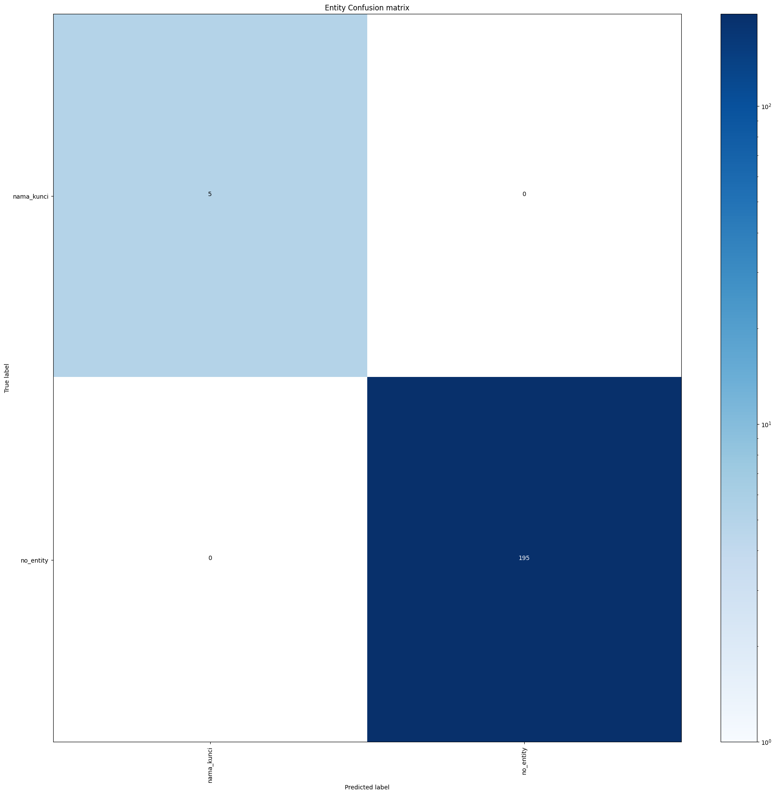

# Rasa Chatbot (v3.5.0)

Bot interaktif berbasis teks yang dibangun menggunakan framework **Rasa Open Source (v3.5.0)** untuk menangani pemrosesan bahasa alami (NLU) dan manajemen dialog secara lokal.

---

## 📌 Fitur Utama

- **Intent Recognition & Entity Extraction**: Mampu memahami maksud pesan pengguna dan mengambil variabel data penting.
- **Custom Actions**: Logika kustom dan integrasi eksternal berbasis Python SDK (`rasa-sdk`).
- **Local Deployment**: Berjalan sepenuhnya di lingkungan lokal tanpa tergantung pada API luar berbayar.

---

## 🛠️ Teknologi & Prasyarat

- **Python**: v3.8 atau v3.9 *(disarankan memakai Virtual Environment)*
- **Rasa Open Source**: v3.5.0
- **Rasa SDK**: v3.5.x

---

## ⚙️ Cara Instalasi & Penggunaan

### 1. Clone Repositori
git clone [https://github.com/username/nama-repo-bot.git](https://github.com/username/nama-repo-bot.git)
cd nama-repo-bot

### 2. Buat & Aktifkan Virtual Environment
python -m venv venv

# Mengaktifkan di Windows:
.\venv\Scripts\activate

# Mengaktifkan di Linux / macOS:
source venv/bin/activate

### 3. Instal Dependensi
pip install --upgrade pip
pip install rasa==3.5.0

### 4. Pelatihan Model (Training)
rasa train

### 5. Jalankan Chatbot
# Terminal 1:
rasa run actions

# Terminal 2:
rasa shell

---

## 📊 Model Evaluation

## 📂 Struktur Folder Proyek

.
├── actions/
│   └── actions.py        # Logika custom action (Python)

├── data/
│   ├── nlu.yml           # Data latihan intent & entity
│   ├── rules.yml         # Aturan percakapan tetap
│   └── stories.yml       # Alur dialog percakapan (training stories)

├── config.yml            # Konfigurasi NLU pipeline & policy
├── domain.yml            # Definisi intent, entities, slots, & responses
├── credentials.yml       # Konfigurasi channel / integrasi
├── endpoints.yml         # Konfigurasi endpoint (action server, storage)
├── Dockerfile            # Config Docker (Eksperimental / Belum diuji penuh)
└── README.md             # Dokumentasi proyek

Catatan Penting: File konfigurasi seperti Dockerfile di repositori ini disediakan sebagai persiapan deployment opsional dan saat ini masih dalam tahap eksperimen (belum diuji penuh).

---

## 📜 Lisensi

Proyek ini dibangun menggunakan Rasa Open Source v3.5.0 yang dilesensikan di bawah Apache License 2.0.
